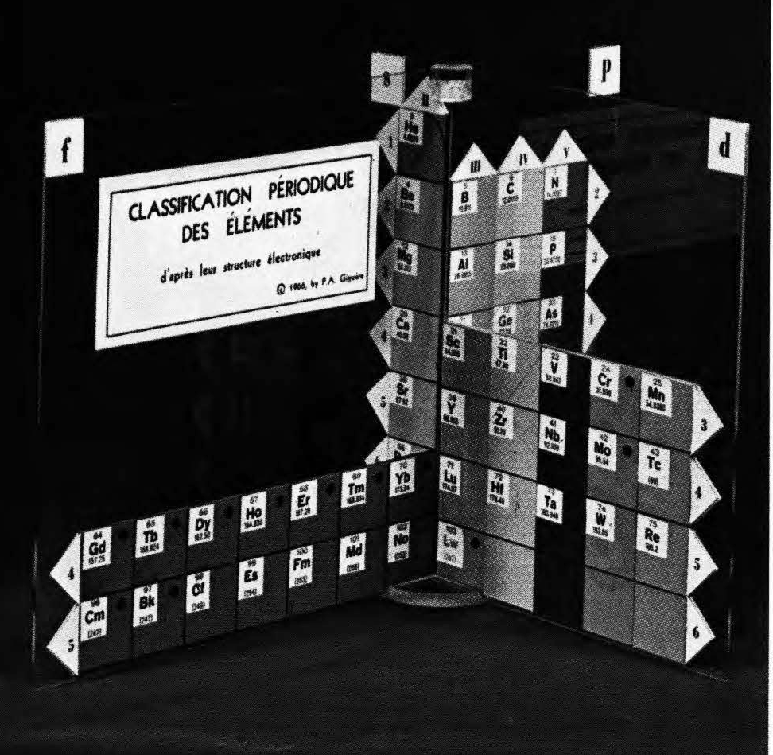
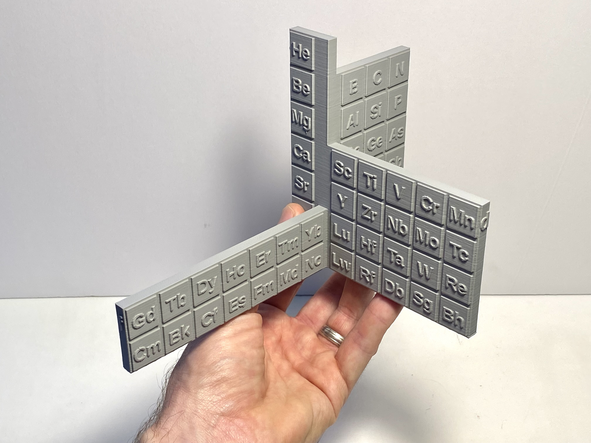

# 3D-printable model of Paul Giguere's 3D periodic table of the elements

In 1966, Canadian chemist [Paul-Antoine Giguère](https://en.wikipedia.org/wiki/Paul-Antoine_Giguère) published a three-dimensional version of the Periodic Table of the Elements.[^1] 

 I wondered if anyone had made a 3D-printable version of Giguère's periodic table and couldn't find one, so I made this using [OpenSCAD](https://openscad.org).  Printed successfully on my Ender 3 using 20% infill and Raft build plate adhesion.

[^1]: Paul Giguère. "The 'new look' for the periodic system." Chemistry in Canada 18 (12), 36–39 (1966) [PDF](https://github.com/wgrover/giguere-3D-periodic-table/blob/main/giguere-1966.pdf).